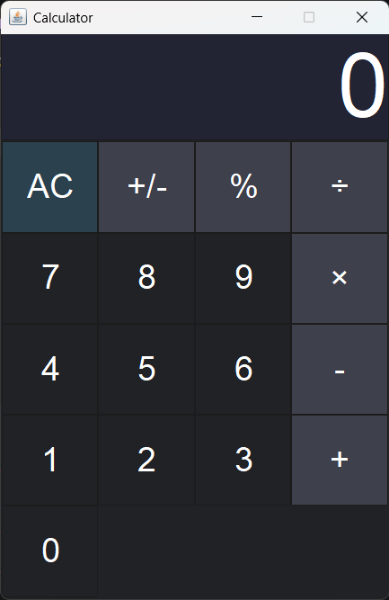

# 🧮 Simple Java Calculator

A desktop calculator application built with Java Swing featuring a clean dark-themed interface and basic arithmetic operations.


## 🎯 Purpose

This project was built to practice:

- Java Swing
- Event-driven programming
- Object-oriented programming
- Git and GitHub workflows

## 📸 Preview

```md
## 📸 Preview



## ✨ Features

- ➕ ➖ ✖️ ➗ Basic arithmetic operations
- ± Toggle sign (positive/negative)
- % Percentage conversion
- AC button to clear and reset the calculator
- Decimal point support
- Automatically removes unnecessary decimals (e.g. `4.0` → `4`)
- Dark-themed interface with color-coded buttons

## 🛠️ Tech Stack

- Language: Java
- GUI Library: Java Swing (`javax.swing`, `java.awt`)

## 📂 Project Structure

```text
.
├── Calculator.java
├── README.md
└── screenshot.png
```

## 🚀 Getting Started

### Clone the repository

```bash
git clone https://github.com/DerbaliAdem/simple-java-calculator.git
cd simple-java-calculator
```

### Compile

```bash
javac Calculator.java
```

### Run

```bash
java Main
```

## 🎮 Usage

| Button | Action |
|--------|--------|
| `0-9` | Input numbers |
| `.` | Add decimal point |
| `+ - × ÷` | Arithmetic operators |
| `=` | Calculate result |
| `+/-` | Toggle sign |
| `%` | Convert to percentage |
| `AC` | Clear calculator |

## ⚠️ Known Limitations

- `√` button is displayed but not yet implemented.
- Chained operations are not fully supported.
- No keyboard input support yet.

## 🗺️ Roadmap

- [ ] Implement square root functionality
- [ ] Support chained operations
- [ ] Add keyboard input support
- [ ] Add unit tests
- [ ] Package as an executable `.jar`

## 🤝 Contributing

Contributions are welcome!

1. Fork the repository
2. Create a branch
3. Commit your changes
4. Push to GitHub
5. Open a Pull Request

## 👤 Author

Made with ☕ and Java by **Adem Derbali**

- GitHub: https://github.com/DerbaliAdem
